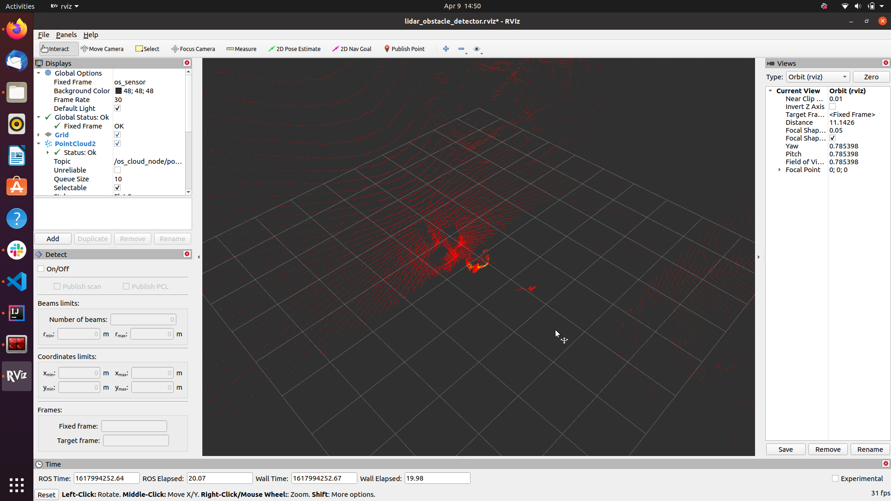

# LIDAR Obstacle Detection

## Description

The goal of this project is to use to various algorithms on Point Cloud data such as Voxel Grid filtering, RANSAC segmentation and Euclidean Clustering with KD-Tree to detect obstacles.

## Pipeline

## Results
The following animation shows the segmented point clouds - obstacles (in yellow) and road (in green)

## Closing thoughts
1. Tracking can used to keep a record of obstacles throughout all the point clouds.
2. 3D Object detection can further aid in determining the type of obstacle (car, traffic signal pole, etc.).

## Running Steps
The project is written in C++ and it is wrapped in ROS. So follow the below step:
1. source ~/catkin_ws/devel/setup.bash
2. Put an rosbag in /resources named as scans_demo.bag (or you can modify launch file)
3. Note that the rosbag should contain topic "/os_cloud_node/points" with "sensor_msgs::PointCloud2" sensor type
4. roslaunch lidar_obstacle_detection pcl.launch
5. You should be able to see the below graph.

## Rostopic published and subscribed
/TunningParam                  : Tunning parameters for external control (communication completed, but not setup with actual parameters yet) 

/box                           : First box from /boxes topics (for testing) 

/boxes                         : /boxes customerized message topics include all bounding box calculated and expressed in two diagonal points (minPoint, maxPoint)

/downsampled_cloud_obstacle    : Downsampled pointcloud for obstacle 

/downsampled_cloud_road        : Downsampled pointcloud for road 

/os_cloud_node/points          : input pointcloud

